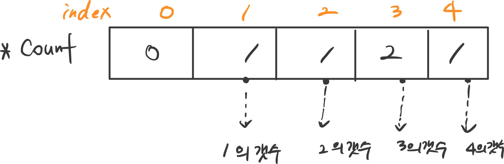

# CountNonDivisible

## Task

given an array A consisting of N integers, returns a sequence of integers representing the amount of non-divisors.


ex \) input : { 3,1,2,3,6 }  =&gt; output : { 2,4,3,2,0 }


* **Given** :  an array A consisting of N integers 
* **Complexity** :  time : O\(N\*log\(N\)\) / space : O\(N\) 
* **Return** :  returns a sequence of integers representing the amount of non-divisors. 

## Solution

### 1. Result : 66%


Time complexity : **O\(N \*\* 2\)**


```cpp
#include <iostream>
#include <vector>

using namespace std;

//약수구하기
int erasto(int index, vector<int> &Arr) {
    int count = 0;

    //if (Arr[index] == 1) return (int)Arr.size()-1;
    
    for (int i=0; i < (int)Arr.size(); i++) {
        if(Arr[i] != Arr[index] && Arr[index] % Arr[i] != 0)
            count++;
    }
    return count;
}

vector<int> solution(vector<int> &A) {
    int total = (int)A.size();
    vector<int> resultArr(A.size());
    
    for (int i = 0; i < total; i++)
        resultArr[i] = erasto(i, A);
    
    return resultArr;
}
```


### 2. Result : 100%

```cpp
#include <iostream>
#include <vector>
#include <algorithm>

using namespace std;

vector<int> solution(vector<int> &A) {
    int totalNum = (int)A.size();
    vector<int> count(*max_element(A.begin(), A.end())+1 , 0);   //가장 큰수+1개를 만들어준다(0포함), max_element는 포인터기때문에 *붙여주기
    vector<int> result(A.size());
    
    //count에 element들의 갯수를 넣는다.
    for (int k = 0; k < totalNum; k++) {
        count[A[k]] +=1;
    }
    
    // i= A 인덱스
    for (int i = 0; i < totalNum; i++) {
        int divisorNum = 0;
        for (int j = 1; j * j < A[i] ; j++){
            if (A[i] % j == 0){
                divisorNum += count[j];  //약수를 담는다.
                if (A[i] / j != j)
                    divisorNum += count[A[i] / j];//약수의 짝궁을 담는다. (단, 3*3 =9 의 경우 처럼 자기자신이 짝일경우 제외)
            }
            result[i] = totalNum - divisorNum;
        }
    }
    return result;
}
```




